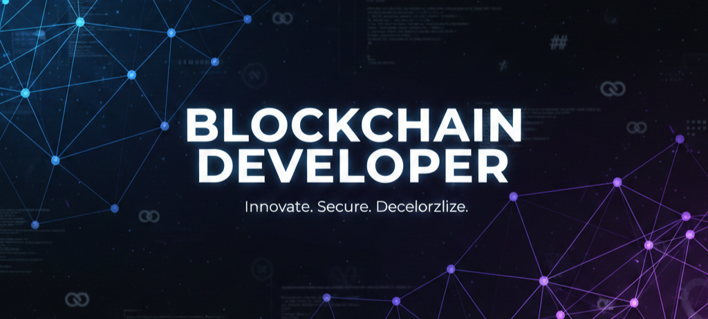

  

  

<h1 align="center">Hi 👋, I'm B.ARUN</h1>
<h3 align="center">A passionate block chain developer</h3>

- 🌱 I’m currently learning *Block chain*

- 📫 How to reach me *arunbandari15@gmail.com*

-   | build on @solana | BuDSwGWQfEaLLa7PQP7UsAL89pG52LKJLvapKHwrLKWg =​>😎 |

<h3 align="left">Connect with me:</h3>

<h3 align="left">[My Skills]:</h3>

 

  

  
  
 

&nbsp;

